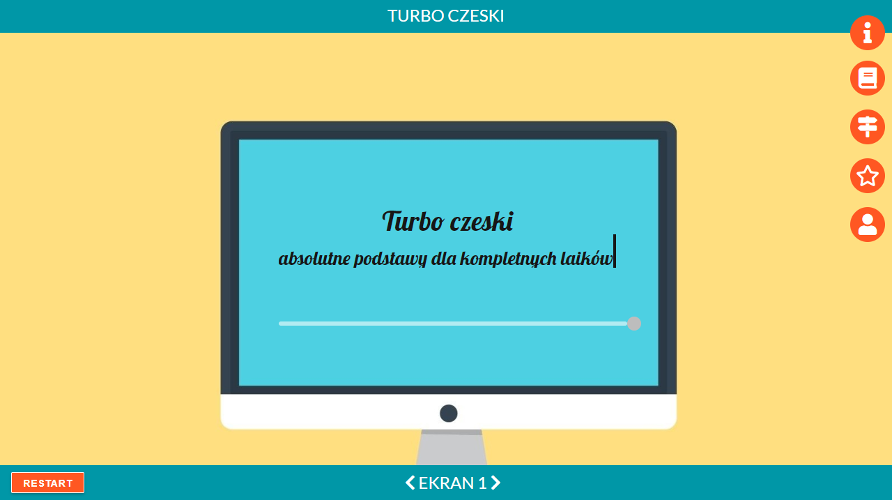
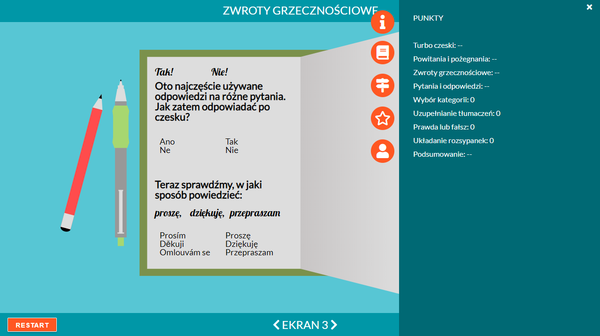
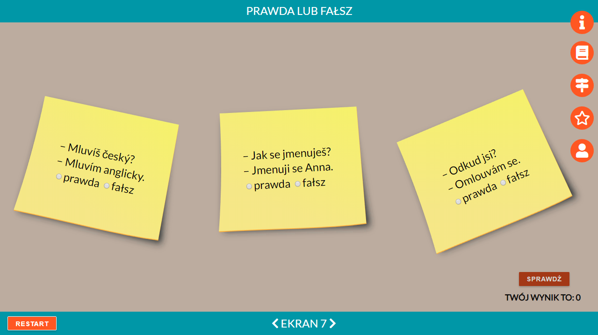

# Turbo-czeski
> Turbo-czeski is a e-learning mini course of Czech language.
Link to demo: https://laililang.github.io/Turbo-czeski

## Table of contents
* [General info](#general-info)
* [Screenshots](#screenshots)
* [Technologies](#technologies)
* [Setup](#setup)
* [Status](#status)
* [License](#license)
* [Contact](#contact)

## General info
My motivation for writing this project was creating useful web application and learning new technologies, in this case for me: AgularJS and GreenSock (GSAP).
The purpose of the Turbo-czeski is showing how nice and fun might be learning new languages.

## Screenshots

## Technologies
* AngularJS - version 1.6.10
* Angular-route
* GSAP - version 2.0.1

## Setup
Install: use local server like XAMP or Mongoose

## Status
Project is finished :)

## License
This project is licensed under the terms of the MIT license.

## Contact
Created by Arleta Jędrzejczak(https://laililang.github.com/Memory/) - feel free to contact me!
